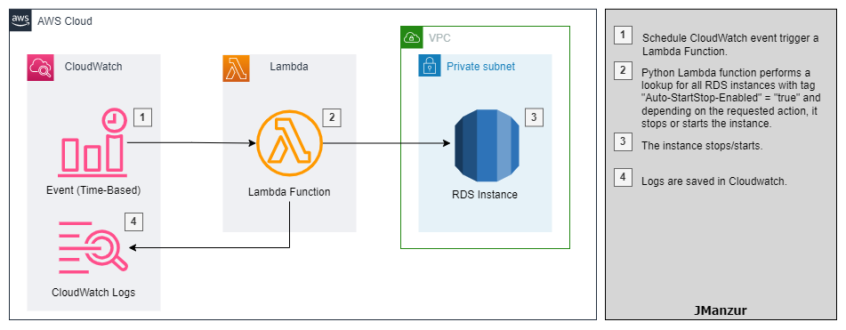
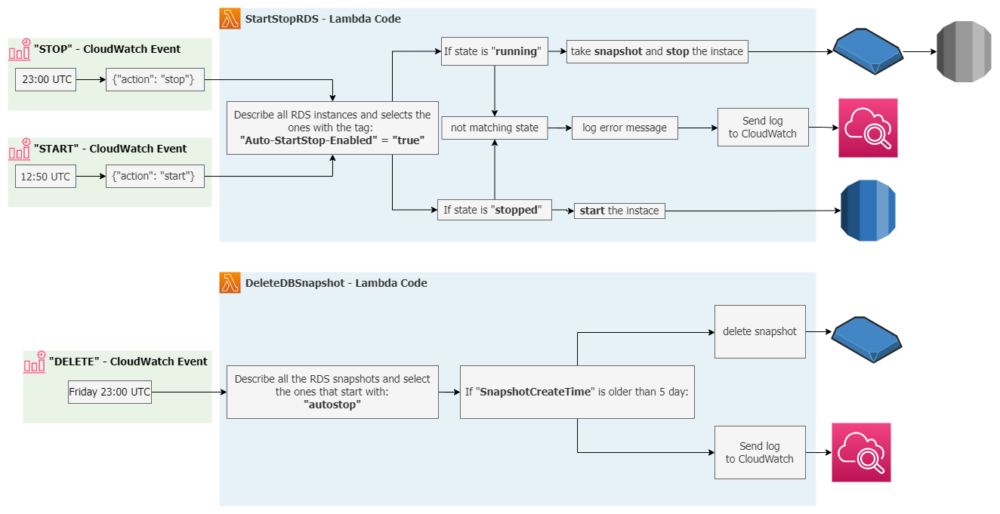

# Starting and Stopping RDS instances using a Lambda function.

In order to save cost on computing resources, it is good practice to stop non-production RDS instances during non-business hours. To achieve that, this solution will implement a python lambda function triggered by a CloudWatch schedule event, the lambda function will perform a lookup on all RDS instances of the AWS account with the tag "Auto-StartStop-Enabled" = "true", and those that match the criteria will be stop/start. Also, a snapshot of the instance will be taken before the instance is stopped and a second lambda function will delete all snapshots older than 5 days (created by the previous lambda) every Friday.

> :bulb: Are you interested in the same type of solution for EC2? check [this repo](https://github.com/JManzur/StartStopEC2)

## Resources deployed by this manifest:

- StartStopRDS Python lambda fucntion.
- DeleteDBSnapshot Python lambda fucntion.
- CloudWatch time-based event rules.
- IAM Policys and Roles

### Deployment diagram:



### Lambda Code diagram:


## Tested with: 

| Environment | Application | Version  |
| ----------------- |-----------|---------|
| WSL2 Ubuntu 20.04 | Terraform | v1.2.1 |

## Initialization How-To:
Located in the root directory, make an "aws configure" to log into the aws account, and a "terraform init" to download the necessary modules and start the backend.

```bash
aws configure
terraform init
```

## Deployment How-To:

Located in the root directory, make the necessary changes in the variables.tf file and run the manifests:

> :warning: Since this is just a demo, all CloudWatch events are disabled, to enable it, change the variable "enable_event_rules" to "true" (without quotes)

```bash
terraform apply
```

## Author:

- [@JManzur](https://jmanzur.com)

## Documentation:

- [Python SDK documentation for RDS](https://boto3.amazonaws.com/v1/documentation/api/latest/reference/services/rds.html)